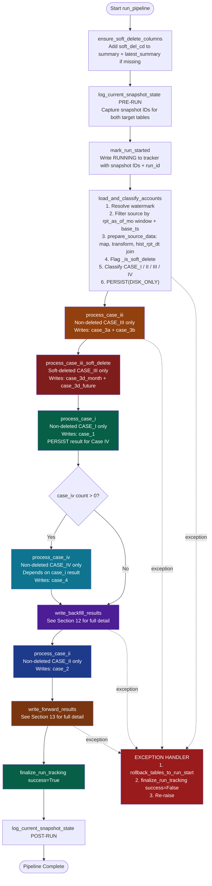
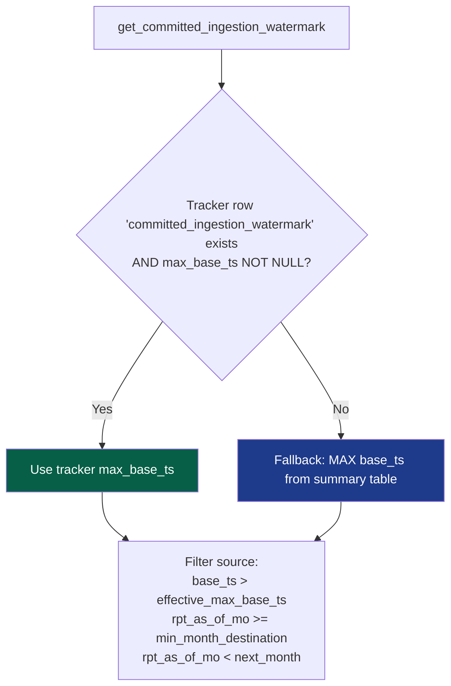
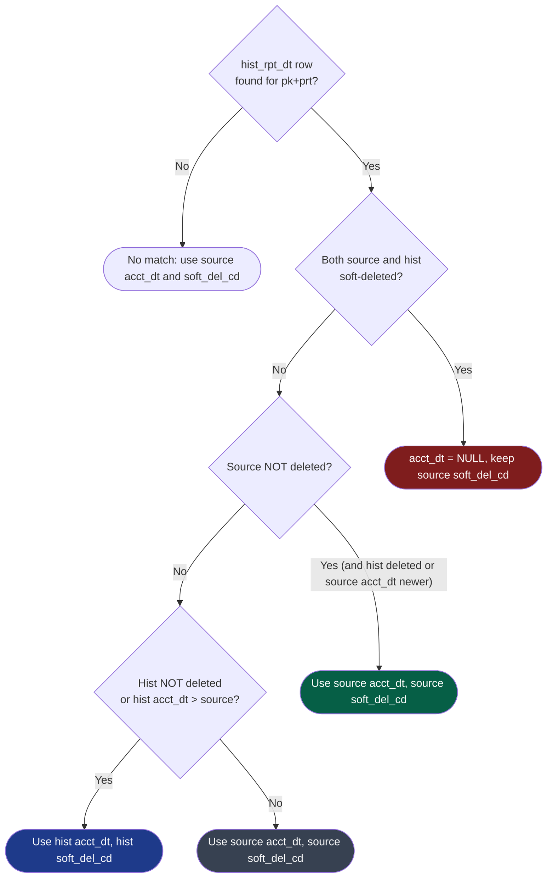
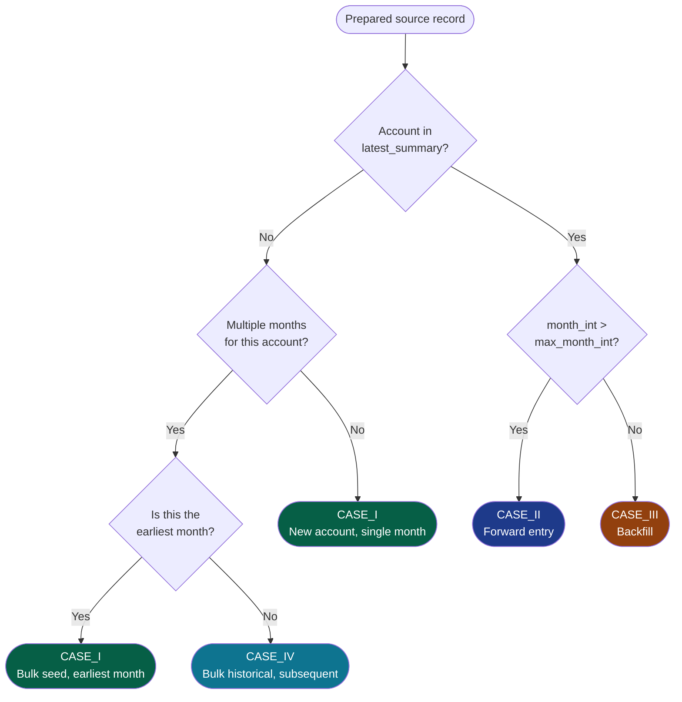

# Summary Pipeline — Technical Design Document

**Document Version**: 2.1
**Pipeline Version**: main (post v9.4.8)
**Last Updated**: March 2026
**Author**: DataDominion Team

---

## Table of Contents

1. [Executive Summary](#1-executive-summary)
2. [System Overview](#2-system-overview)
3. [Architecture & Processing Flow](#3-architecture--processing-flow)
4. [Watermark Tracker & Run Lifecycle](#4-watermark-tracker--run-lifecycle)
5. [Data Preparation](#5-data-preparation)
6. [Case Classification](#6-case-classification)
7. [Case I: New Accounts](#7-case-i-new-accounts)
8. [Case II: Forward Entries](#8-case-ii-forward-entries)
9. [Case III: Backfill](#9-case-iii-backfill)
10. [Case III-D: Soft Delete](#10-case-iii-d-soft-delete)
11. [Case IV: Bulk Historical Load](#11-case-iv-bulk-historical-load)
12. [Write Phase — Backfill Results](#12-write-phase--backfill-results)
13. [Write Phase — Forward Results](#13-write-phase--forward-results)
14. [Failure Recovery & Rollback](#14-failure-recovery--rollback)
15. [Performance Considerations](#15-performance-considerations)
16. [Configuration Reference](#16-configuration-reference)
17. [Constants Reference](#17-constants-reference)
18. [Assumptions & Invariants](#18-assumptions--invariants)

---

## 1. Executive Summary

### 1.1 Purpose

The Summary Pipeline maintains **36-month rolling history arrays** for consumer credit accounts. It incrementally processes incoming account data from a source Iceberg table and maintains a denormalized summary table with pre-computed arrays for efficient downstream queries.

### 1.2 Scale

| Metric | Value |
|--------|-------|
| Summary Table Size | ~8 TB |
| Summary Table Records | 500+ Billion |
| Unique Accounts | ~2 Billion |
| Rolling History Window | 36 months per account |
| Rolling Columns | 7 arrays per record |
| Monthly Throughput | ~50–100 Million records |

### 1.3 Why Case-wise Processing?

Records are separated into four cases to minimise I/O:

| Case | Frequency | I/O Pattern | Why Separate? |
|------|-----------|-------------|---------------|
| Case I | ~5% | Write only | No joins needed — brand new account |
| Case II | ~90% | Join latest row only | 50x less I/O than reading full summary |
| Case III | ~4% | Read full history | Expensive but unavoidable for backfill |
| Case IV | ~1% | Window on new data only | Bulk optimisation, no summary read |

---

## 2. System Overview

### 2.1 Technology Stack

| Component | Technology |
|-----------|------------|
| Processing Engine | Apache Spark 3.5+ |
| Table Format | Apache Iceberg (MOR) |
| Storage | AWS S3 |
| Catalog | AWS Glue (`primary_catalog`) |
| Temp Storage | Hadoop Iceberg (`temp_catalog`) |
| Orchestration | AWS EMR / Airflow |
| Config Storage | AWS S3 (JSON) |

### 2.2 Tables

| Table | Purpose | Key Columns | Layout |
|-------|---------|-------------|--------|
| `accounts_all` | Source — raw monthly account snapshots | All raw columns | Partitioned by `rpt_as_of_mo` |
| `hist_rpt_dt` | Source — historical reporting dates for `acct_dt` resolution | `cons_acct_key`, `acct_dt`, `soft_del_cd`, `base_ts` | — |
| `summary` | Target — denormalised 36-month rolling arrays | Mapped cols + `*_history` + `soft_del_cd` | Partitioned by `rpt_as_of_mo`, bucketed(64, `cons_acct_key`) |
| `latest_summary` | Target — latest row per account | Same as summary (subset) + `soft_del_cd` | Bucketed |
| `watermark_tracker` | Control — pipeline run state & idempotency | `source_name`, snapshots, `status`, `run_id` | None |

### 2.3 Rolling History Arrays

Each summary record contains arrays of length 36:

```
balance_am_history = [current, prev_1, prev_2, ..., prev_35]
                      ^
                      |
                    Position 0 = Current month's value
                    Position 35 = 35 months ago
```

**Rolling Columns (7 total):**

| Column | Type | Description |
|--------|------|-------------|
| `actual_payment_am_history` | array | Monthly actual payment amounts |
| `balance_am_history` | array | Monthly outstanding balances |
| `credit_limit_am_history` | array | Monthly credit limits |
| `past_due_am_history` | array | Monthly past-due amounts |
| `payment_rating_cd_history` | array | Monthly payment rating codes |
| `days_past_due_history` | array | Monthly days past due |
| `asset_class_cd_4in_history` | array | Monthly asset classification |

**Grid Column (derived):**
- `payment_history_grid` — 36-character string concatenation of `payment_rating_cd_history`, using `?` as placeholder for NULL

---

## 3. Architecture & Processing Flow

### 3.1 Design Principles

1. **Minimise I/O** — read only what is absolutely necessary per case
2. **Case Optimisation** — each case has its own processing path and merge strategy
3. **Partition Pruning** — all Iceberg reads use explicit partition filters
4. **Idempotent Runs** — watermark tracker + rollback ensures safe reruns
5. **Bucketed Temp Tables** — per-case temp tables match summary layout for co-partitioned merges
6. **Chunked Merges** — prevent oversized Iceberg commits via month-balanced chunking

### 3.2 Entry Point (`main()`)

```
1. Load config from S3 (load_config)
2. Validate config (validate_config)
3. Create Spark session (create_spark_session)
4. cleanup()                             — DROP all 7 temp tables
5. run_pipeline()                        — the core pipeline
6. spark.stop()
```

### 3.3 Pipeline Processing Flow (`run_pipeline()`)



### 3.4 Per-Case Temp Tables (Bucketed)

All temp tables are created by `write_case_table_bucketed()` as Iceberg tables:
- **Partitioned by** `rpt_as_of_mo`
- **Bucketed into** 64 buckets by `cons_acct_key` (configurable via `case_temp_bucket_count`)
- **Distribution mode**: `hash` for both `write.distribution-mode` and `write.merge.distribution-mode`
- **Retry logic**: up to 3 attempts with `DROP TABLE IF EXISTS` before `CREATE TABLE ... AS SELECT`

| Temp Table | Written By | Read By | Content |
|------------|------------|---------|---------|
| `checkpointdb.case_1` | `process_case_i` | `write_backfill_results` | New account rows with initialised arrays |
| `checkpointdb.case_2` | `process_case_ii` | `write_forward_results` | Forward entries with shifted arrays |
| `checkpointdb.case_3a` | `process_case_iii` | `write_backfill_results` | New backfill rows with inherited history |
| `checkpointdb.case_3b` | `process_case_iii` | `write_backfill_results` | Future row patches (arrays + grid only) |
| `checkpointdb.case_3d_month` | `process_case_iii_soft_delete` | `write_backfill_results` | Month-row `soft_del_cd` + `base_ts` flags |
| `checkpointdb.case_3d_future` | `process_case_iii_soft_delete` | `write_backfill_results` | Future row array nullification + grid patches |
| `checkpointdb.case_4` | `process_case_iv` | `write_backfill_results` | Bulk historical rows with MAP-built arrays |

All 7 temp tables are dropped by `cleanup()` at the start of every run (called from `main()` before `run_pipeline()`).

---

## 4. Watermark Tracker & Run Lifecycle

### 4.1 Purpose

The watermark tracker is a dedicated Iceberg table that records the last pipeline run state. It enables:
- **Safe incremental reruns** — next run picks up from the last committed watermark
- **Automatic rollback** — on failure, tables are rolled back to pre-run snapshots
- **Run auditing** — each run is identified by a unique `run_id` with status tracking

### 4.2 Schema

```sql
CREATE TABLE IF NOT EXISTS {tracker_table} (
    source_name                      STRING,   -- 'summary' | 'latest_summary' | 'committed_ingestion_watermark'
    source_table                     STRING,   -- fully qualified table name
    max_base_ts                      TIMESTAMP,
    max_rpt_as_of_mo                 STRING,
    updated_at                       TIMESTAMP,
    previous_successful_snapshot_id  BIGINT,
    current_snapshot_id              BIGINT,
    status                           STRING,   -- 'RUNNING' | 'SUCCESS' | 'FAILURE'
    run_id                           STRING,
    error_message                    STRING
) USING iceberg
```

The tracker always contains **3 rows**: one for `summary`, one for `latest_summary`, and one for `committed_ingestion_watermark`.

### 4.3 Tracker Table Resolution

```python
# From config (explicit):
config.get("watermark_tracker_table")

# Derived fallback:
"{namespace}.summary_watermark_tracker"
```

### 4.4 Run Lifecycle

| Phase | Function | Action |
|-------|----------|--------|
| Pre-run | `ensure_soft_delete_columns()` | ALTER TABLE to add `soft_del_cd` if missing |
| Pre-run | `log_current_snapshot_state("Pre-run")` | Captures snapshot IDs + max_base_ts + max_rpt_as_of_mo for both tables |
| Pre-run | `mark_run_started()` | Writes `status='RUNNING'` with pre-run snapshot IDs to all 3 tracker rows |
| Success | `finalize_run_tracking(success=True)` | Captures end state, sets `status='SUCCESS'`, advances committed watermark = `MIN(summary_ts, latest_summary_ts)` |
| Failure | `rollback_tables_to_run_start()` | `CALL {catalog}.system.rollback_to_snapshot(...)` for both tables |
| Failure | `finalize_run_tracking(success=False)` | Sets `status='FAILURE'`, records error_message (truncated to 500 chars), does NOT advance committed watermark |

### 4.5 Watermark Resolution (`get_committed_ingestion_watermark`)



### 4.6 Pre-flight Validation

```python
if max_month_destination != max_month_latest_history:
    raise ValueError("max months do not match")
```

If `effective_max_base_ts` is None after resolution, it defaults to `datetime(1900, 1, 1)`.

---

## 5. Data Preparation

### 5.1 `prepare_source_data(df, date_df, config)`

Executed for every incoming record before classification. Steps run in order:

| Step | Action | Config Key |
|------|--------|------------|
| 1 | Rename source -> destination column names | `columns` |
| 2 | Apply sentinel value transformations (large negatives -> NULL) | `column_transformations` |
| 3 | Evaluate inferred/derived columns (`orig_loan_am`, `payment_rating_cd`) | `inferred_columns` |
| 4 | Prepare rolling column values (apply `mapper_expr`) | `rolling_columns[].mapper_expr` |
| 5 | Validate date columns: `year < 1000` -> NULL | `date_col_list` |
| 6 | Deduplicate: per `(pk, prt)`, keep highest `base_ts` (tie-break: `insert_ts`, `update_ts`) | — |
| 7 | Join with `hist_rpt_dt` to resolve `acct_dt` and `soft_del_cd` | `hist_rpt_dt_table`, `hist_rpt_dt_cols` |

### 5.2 hist_rpt_dt Join — acct_dt & soft_del_cd Resolution

The `hist_rpt_dt` table is also filtered by `base_ts > effective_max_base_ts`, deduplicated per `(pk, prt)`, then **broadcast-joined** to the main source.

The join resolves both `acct_dt` and `soft_del_cd` simultaneously using CASE logic:



### 5.3 Post-preparation Columns Added

After `prepare_source_data()` returns to `load_and_classify_accounts()`:

```python
month_int = YEAR * 12 + MONTH   # from rpt_as_of_mo
_is_soft_delete = COALESCE(soft_del_cd, '') IN ('1', '4')
```

---

## 6. Case Classification

### 6.1 Classification Algorithm (`load_and_classify_accounts`)



### 6.2 Soft Delete Filtering (at `run_pipeline` level)

Classification itself does NOT filter by `soft_del_cd`. Instead, `run_pipeline()` applies filters when dispatching to processors:

| Processor | Filter Applied |
|-----------|---------------|
| `process_case_iii` | `case_type == 'CASE_III'` AND `NOT _is_soft_delete` |
| `process_case_iii_soft_delete` | `case_type == 'CASE_III'` AND `_is_soft_delete` |
| `process_case_i` | `case_type == 'CASE_I'` AND `NOT _is_soft_delete` |
| `process_case_iv` | `case_type == 'CASE_IV'` AND `NOT _is_soft_delete` |
| `process_case_ii` | `case_type == 'CASE_II'` AND `NOT _is_soft_delete` |

### 6.3 Classification Matrix

| Account Exists? | Months in Batch | Month vs Latest | Classification |
|-----------------|-----------------|-----------------|----------------|
| NO | 1 | N/A | CASE_I |
| NO | >1, earliest | N/A | CASE_I (seed) |
| NO | >1, not earliest | N/A | CASE_IV |
| YES | any | new > latest | CASE_II |
| YES | any | new <= latest | CASE_III |

### 6.4 MONTH_DIFF

Computed for Case II and Case IV records:

```
CASE_II:  MONTH_DIFF = month_int - max_month_int       (from latest_summary)
CASE_IV:  MONTH_DIFF = month_int - min_month_for_new_account  (from batch)
Others:   MONTH_DIFF = 1
```

---

## 7. Case I: New Accounts

### 7.1 Definition

- Account does **NOT** exist in `latest_summary`
- Either only **one** month in current batch, or this is the **earliest** month of a multi-month new account

### 7.2 Processing (`process_case_i`)

```
Input:  Account 9001, Month 2026-01, balance = 5000

Output: balance_am_history = [5000, NULL, NULL, ..., NULL]   (36 elements)
```

For each rolling column:
```python
array(current_value) + array_repeat(NULL, 35)   # → [value, NULL×35]
```

Grid columns are derived via `TRANSFORM` + `COALESCE(x, placeholder)`.

The result is **persisted** (`MEMORY_AND_DISK`) because Case IV needs it as a seed.

### 7.3 Temp Output

Written to `temp_catalog.checkpointdb.case_1` via `write_case_table_bucketed()`.

---

## 8. Case II: Forward Entries

### 8.1 Definition

- Account **EXISTS** in `latest_summary`
- `month_int > max_month_int` (new month is ahead of latest)

### 8.2 Soft-Delete-Aware Context Loading

The latest_summary context is loaded with a filter:

```sql
SELECT l.{pk}, l.{prt}, l.*_history
FROM {latest_summary_table} l
WHERE l.{pk} IN (SELECT {pk} FROM case_ii_affected_keys)
  AND COALESCE(l.soft_del_cd, '') NOT IN ('1', '4')
```

Accounts whose only context is soft-deleted are treated as **unresolved** — they receive Case-I-style fresh arrays.

### 8.3 Array Shifting with Peer Map

Case II also builds a `peer_map` (same as Case III) to handle gap filling when multiple forward months arrive for the same account:

```sql
CASE
    WHEN MONTH_DIFF = 1 THEN
        slice(concat(array(new_value), prev_history), 1, 36)
    WHEN MONTH_DIFF > 1 THEN
        slice(concat(
            array(new_value),
            -- Fill gap positions from peer_map
            transform(sequence(1, MONTH_DIFF - 1),
                i -> peer_map[month_int - i].val),
            prev_history
        ), 1, 36)
    ELSE
        -- Unresolved: fresh array
        concat(array(new_value), array_repeat(NULL, 35))
END
```

### 8.4 Temp Output

Written to `temp_catalog.checkpointdb.case_2` via `write_case_table_bucketed()`.

---

## 9. Case III: Backfill

### 9.1 Definition

- Account **EXISTS** in `latest_summary`
- `month_int <= max_month_int` (late-arriving historical data)
- `_is_soft_delete` is **false**

### 9.2 Summary Read (Partition-Pruned)

```sql
SELECT {pk}, {prt}, {ts}, *_history
FROM summary
WHERE rpt_as_of_mo >= (min_backfill_month - 36)
  AND rpt_as_of_mo <= (max_backfill_month + 36)
  AND COALESCE(soft_del_cd, '') NOT IN ('1', '4')
```

Only reads summary rows for the affected accounts (`left_semi` join).

### 9.3 Part A — New Backfill Rows (`case_3a`)

For each backfill record:
1. Find the closest **PRIOR** summary row (by `month_int`, `ROW_NUMBER() ... ORDER BY month_int DESC`)
2. Build the new array using `peer_map` for gap filling:

```
CASE
    WHEN prior exists AND months_since_prior > 0:
        [backfill_value,
         gap_fill_from_peer_map,
         prior_history_patched_with_peer_map]
    ELSE:
        [backfill_value, peer_map lookups for prior months]
END
```

3. Generate grid columns from arrays
4. Deduplicate by `(pk, prt)` keeping highest `base_ts`
5. Write to `temp_catalog.checkpointdb.case_3a`

### 9.4 Part B — Future Row Patches (`case_3b`)

For every future summary row where the backfill month's data should appear:

```sql
JOIN summary_affected s ON b.{pk} = s.{pk}
WHERE s.month_int >= b.month_int
  AND (s.month_int - b.month_int) < 36
```

When **multiple backfills** arrive for the same account:
1. `GROUP BY (pk, summary_month)` and `collect_list(struct(position, values))`
2. For each array position, check if any backfill targets it using `filter(backfill_list, b -> b.position = i)`
3. Apply all updates in one pass: `transform(existing_array, (x, i) -> CASE WHEN match THEN backfill_value ELSE x END)`
4. `base_ts = GREATEST(existing_summary_ts, new_base_ts)`
5. Generate grid columns
6. Write to `temp_catalog.checkpointdb.case_3b`

### 9.5 Chunked Merge (Bin-Packing)

```python
weighted_load = case3a_count + (case3b_weight * case3b_count)
chunks = build_balanced_month_chunks(month_weights, overflow_ratio=0.10)
```

The bin-packing uses a greedy algorithm:
- Largest month becomes the target load
- Each subsequent month goes into the lightest bin if it fits within `target * (1 + overflow_ratio)`
- Otherwise, a new bin is opened

---

## 10. Case III-D: Soft Delete

### 10.1 Definition

- Account **EXISTS** in `summary`
- `_is_soft_delete` is **true** (`soft_del_cd IN ('1', '4')`)
- `case_type == 'CASE_III'` (month <= latest)

### 10.2 Constants

```python
SOFT_DELETE_COLUMN = "soft_del_cd"
SOFT_DELETE_CODES  = ["1", "4"]
```

### 10.3 Schema Pre-flight (`ensure_soft_delete_columns`)

Called once at the start of `run_pipeline()`. For each of `summary` and `latest_summary`:

```sql
ALTER TABLE {table} ADD COLUMN soft_del_cd STRING
```

Only executed if the column doesn't already exist.

### 10.4 Processing (`process_case_iii_soft_delete`)

```mermaid
%%{init: {"flowchart": {"useMaxWidth": true}} }%%
graph TD
    SRC(["Soft delete records<br/>CASE_III + _is_soft_delete"])
    VAL{"Delete month<br/>exists in summary?"}
    SKIP(["Ignored: non-existing months"])

    subgraph PART_A["Part A: Month-row flag"]
        A1["Select pk, prt, base_ts, soft_del_cd"]
        A2(["Write to case_3d_month"])
    end

    subgraph PART_B["Part B: Future array nullification"]
        B1["Find future summary rows<br/>month_int > delete_month_int<br/>AND diff < 36"]
        B2["GROUP BY pk, summary_month<br/>collect_set delete_positions"]
        B3["transform existing_array:<br/>IF array_contains positions, i THEN NULL ELSE x"]
        B4["base_ts = GREATEST existing, delete"]
        B5["Rebuild grid columns"]
        B6(["Write to case_3d_future"])
    end

    SRC --> VAL
    VAL -- No --> SKIP
    VAL -- Yes --> PART_A & PART_B
    A1 --> A2
    B1 --> B2 --> B3 --> B4 --> B5 --> B6

    style PART_A fill:#1c1c1c,stroke:#dc2626
    style PART_B fill:#1c1c1c,stroke:#f59e0b
```



### 10.5 Part A — Month-Row Update

Only 2 columns are updated on the target month's summary row:

| Column | Value |
|--------|-------|
| `soft_del_cd` | Incoming delete code (`'1'` or `'4'`) |
| `base_ts` | `GREATEST(existing.base_ts, incoming.base_ts)` |

Arrays, grid columns, and all other scalar columns are **NOT modified**.

### 10.6 Part B — Future Array Nullification

```
Account 3001 has rows for Oct, Nov, Dec 2025
Soft delete arrives for Oct 2025

delete_position for Nov = 202511 - 202510 = 1
delete_position for Dec = 202512 - 202510 = 2

Before:
  Nov: balance_am_history = [4500, 4000, 3500, ...]   (pos 1 = Oct)
  Dec: balance_am_history = [5000, 4500, 4000, ...]   (pos 2 = Oct)

After:
  Nov: balance_am_history = [4500, NULL, 3500, ...]
  Dec: balance_am_history = [5000, 4500, NULL, ...]
```

All 7 rolling columns are patched. Grid columns are rebuilt. When multiple deletes hit the same future row, positions are collected via `collect_set` and applied in one `transform` pass.

### 10.7 Summary Read

The summary read is partition-pruned identically to Case III (±36 months from delete range), but does **NOT** exclude soft-deleted rows (uses `SELECT *`), because we need to match the delete month's existing row.

---

## 11. Case IV: Bulk Historical Load

### 11.1 Definition

- Account does **NOT** exist in `latest_summary`
- **Multiple** months arrive in the current batch
- Only the **subsequent** months (earliest is handled by Case I)

### 11.2 Processing (`process_case_iv`)

Uses `MAP_FROM_ENTRIES` + `TRANSFORM` strategy:

1. Union Case IV records with Case I records for the same accounts
2. For each account, build a MAP: `month_int -> value` using `COLLECT_LIST(STRUCT(month_int, value))`
3. For each row, generate array via `TRANSFORM(SEQUENCE(0, 35), pos -> MAP[month_int - pos])`

```
Account 8001, 12 months (Jan–Dec 2025):
  Jan: [10000, NULL,  NULL,  ...]     ← from Case I seed
  Feb: [9500,  10000, NULL,  ...]     ← MAP lookup pos 0-35
  Dec: [4500,  5000, ..., 10000, ...]  ← full window
```

Missing months return NULL automatically (the MAP key doesn't exist).

4. Filter result to only Case IV records (exclude Case I seed row which is already in `case_1`)
5. Write to `temp_catalog.checkpointdb.case_4`

### 11.3 Invariant

```
Case IV cannot exist without Case I in the same batch.
If case_i_result is None, Case IV processing is skipped.
```

---

## 12. Write Phase — Backfill Results

`write_backfill_results()` handles Case III (3a + 3b), Case III-D (3d_month + 3d_future), Case I, and Case IV. All merges target the `summary` and `latest_summary` tables.

### 12.1 Merge Order

```
 1. MERGE case_3a -> summary      (chunked by month)  — INSERT or UPDATE SET *
 2. MERGE case_3b -> summary      (chunked by month)  — UPDATE explicit cols only
 3. MERGE case_3d_month -> summary (chunked)           — UPDATE soft_del_cd + GREATEST(ts)
 4. MERGE case_3d_future -> summary (chunked)          — UPDATE ts + *_history + grid cols
 5. MERGE case_1 + case_4 -> summary (chunked)         — MATCHED ts guard + INSERT
 6. UPDATE latest_summary for Case I/IV                — month/ts guard
 7. UPDATE latest_summary for Case III                 — 3b priority over 3a
 8. UPDATE latest_summary for Case III-D future patches — pk + prt match
 9. UPDATE latest_summary for Case III-D month flags   — soft_del_cd + GREATEST(ts)
10. RECONSTRUCT latest_summary for deleted-latest      — replace with next non-deleted row
```

### 12.2 Case 3a Merge (Chunked)

```sql
MERGE INTO summary s
USING case_3a_chunk c
ON s.{pk} = c.{pk} AND s.{prt} = c.{prt}
WHEN MATCHED THEN UPDATE SET *
WHEN NOT MATCHED THEN INSERT *
```

### 12.3 Case 3b Merge (Chunked, Explicit Columns)

Case 3b is first filtered via `left_anti` join against case_3a to avoid duplicate updates:

```sql
MERGE INTO summary s
USING case_3b_chunk c
ON s.{pk} = c.{pk} AND s.{prt} = c.{prt}
WHEN MATCHED THEN UPDATE SET
    s.base_ts = GREATEST(s.base_ts, c.base_ts),
    s.{history_col_1} = c.{history_col_1},  -- all 7 history columns
    s.{grid_col} = c.{grid_col}             -- grid columns
```

### 12.4 Case 3d_month Merge (Chunked)

```sql
MERGE INTO summary s
USING case_3d_month_chunk c
ON s.{pk} = c.{pk} AND s.{prt} = c.{prt}
WHEN MATCHED THEN UPDATE SET
    s.soft_del_cd = c.soft_del_cd,
    s.base_ts = GREATEST(s.base_ts, c.base_ts)
```

### 12.5 Case 3d_future Merge (Chunked)

Same explicit-column pattern as case_3b: `base_ts` (GREATEST) + all `*_history` + grid columns.

### 12.6 Case I/IV Merge (Chunked)

```sql
MERGE INTO summary s
USING case_1_4_merge_chunk c
ON s.{pk} = c.{pk} AND s.{prt} = c.{prt}
WHEN MATCHED AND c.base_ts >= s.base_ts THEN UPDATE SET *
WHEN NOT MATCHED THEN INSERT *
```

### 12.7 Latest Summary Updates

| Source | latest_summary Match | Guard |
|--------|---------------------|-------|
| Case I/IV | `ON pk` | `s.prt < c.prt OR (s.prt = c.prt AND s.ts <= c.ts)` → UPDATE SET *, else INSERT |
| Case III (3b > 3a) | `ON pk` | `s.prt < c.prt OR (s.prt = c.prt AND s.ts <= c.ts)` → UPDATE explicit cols (GREATEST ts) |
| Case 3d_future | `ON pk AND prt` | `WHEN MATCHED` → UPDATE ts (GREATEST) + histories + grids |
| Case 3d_month | `ON pk AND prt` | `WHEN MATCHED` → UPDATE `soft_del_cd` + `GREATEST(ts)` |

### 12.8 Latest Summary Reconstruction

When a deleted month matches the current `latest_summary` row:

```sql
-- Find the next most recent non-deleted summary row
SELECT * FROM (
    SELECT s.*, ROW_NUMBER() OVER (PARTITION BY pk ORDER BY prt DESC, ts DESC) as _rn
    FROM summary s
    JOIN deleted_latest_accounts a ON s.pk = a.pk
    WHERE COALESCE(s.soft_del_cd, '') NOT IN ('1', '4')
) x WHERE _rn = 1
```

This replacement is merged into `latest_summary` using `build_latest_merge_columns()` which dynamically resolves shared columns.

---

## 13. Write Phase — Forward Results

`write_forward_results()` handles Case II.

### 13.1 Summary Merge (Chunked)

```sql
MERGE INTO summary s
USING case_2_summary_chunk c
ON s.{pk} = c.{pk} AND s.{prt} = c.{prt}
WHEN MATCHED AND c.base_ts >= s.base_ts THEN UPDATE SET *
WHEN NOT MATCHED THEN INSERT *
```

Chunking uses `build_month_chunks_from_df()` with per-month row counts as weights.

### 13.2 Latest Summary Merge

```sql
MERGE INTO latest_summary s
USING case_2 c
ON s.{pk} = c.{pk}
WHEN MATCHED AND (
    c.{prt} > s.{prt}
    OR (c.{prt} = s.{prt} AND c.{ts} >= s.{ts})
) THEN UPDATE SET {dynamic_shared_cols}
```

The update columns are dynamically resolved via `build_latest_merge_columns()` to handle schema evolution gracefully.

---

## 14. Failure Recovery & Rollback

### 14.1 Rollback Mechanism (`rollback_tables_to_run_start`)

On exception in `run_pipeline()`:

```python
# For each of summary, latest_summary:
CALL {catalog}.system.rollback_to_snapshot(
    table => '{identifier}',
    snapshot_id => {pre_run_snapshot_id}
)
```

Uses a two-attempt strategy: first with named arguments, then positional fallback.

### 14.2 Error Handling Flow

```python
except Exception as e:
    if run_start_states is not None:
        rollback_statuses = rollback_tables_to_run_start(...)
        finalize_run_tracking(success=False, error_message=...)
    else:
        refresh_watermark_tracker(mark_committed=False)   # legacy fallback
    raise
```

### 14.3 Legacy Compatibility

`refresh_watermark_tracker()` still exists for backward compatibility. It wraps `finalize_run_tracking()` with a synthetic run_id.

---

## 15. Performance Considerations

### 15.1 Write Partition Sizing (`get_write_partitions`)

```python
# Priority:
1. Explicit config override:  config["write_partitions"]
2. Row-based sizing:          max(expected_rows / target_rows_per_partition, floor_parallelism)
3. Default:                   max(shuffle_partitions, defaultParallelism)

# Bounds: max(MIN_PARTITIONS=16, min(MAX_PARTITIONS=8192, desired))
# Cached once per run via config["_runtime_cache"]
```

### 15.2 Merge Alignment (`align_for_summary_merge`)

Before every MERGE, the source DataFrame is:
1. Repartitioned on `(partition_column, primary_column)` using `get_write_partitions()`
2. Sorted within partitions by `(partition_column, primary_column)`

This aligns the merge source with the summary table's bucket distribution.

### 15.3 Chunked Merge Strategy

All large merges use `build_balanced_month_chunks()` or `build_month_chunks_from_df()`:

| Merge | Chunking strategy | Config key |
|-------|-------------------|------------|
| Case III (3a + 3b) | Weighted bin-packing: `3a_count + 3b_weight * 3b_count` | `case3_merge_case3b_weight` (default 1.3), `case3_merge_overflow_ratio` (default 0.10) |
| Case III-D month | Row-count-based per month | `case3d_month_merge_overflow_ratio` |
| Case III-D future | Row-count-based per month | `case3d_future_merge_overflow_ratio` |
| Case I/IV | Row-count-based per month | `case1_4_merge_overflow_ratio` (default 0.10) |
| Case II | Row-count-based per month | `case2_merge_overflow_ratio` (default 0.10) |

---

## 16. Configuration Reference

Full config lives in S3 as JSON (loaded via `load_config(bucket, key)`).

| Section | Key | Description |
|---------|-----|-------------|
| Tables | `source_table` | Input Iceberg table FQDN |
| Tables | `destination_table` | Summary Iceberg table FQDN |
| Tables | `latest_history_table` | Latest-row snapshot table FQDN |
| Tables | `hist_rpt_dt_table` | Historical reporting date table |
| Tables | `hist_rpt_dt_cols` | Column list to select from hist_rpt_dt_table |
| Tables | `watermark_tracker_table` | Explicit tracker table (optional, derived if absent) |
| Schema | `primary_column` | Account PK (`cons_acct_key`) |
| Schema | `partition_column` | Monthly partition (`rpt_as_of_mo`) |
| Schema | `primary_date_column` | Date column for hist_rpt_dt join (`acct_dt`) |
| Schema | `max_identifier_column` | Watermark timestamp (`base_ts`) |
| Schema | `history_length` | Rolling array length (default 36) |
| Mapping | `columns` | Source -> destination column rename map (incl. `soft_del_cd`) |
| Transform | `column_transformations` | Sentinel -> NULL rules for monetary columns |
| Derived | `inferred_columns` | Calculated cols with `mapper_expr` |
| Arrays | `rolling_columns` | 7 array-column definitions with `name`, `mapper_column`, `mapper_expr`, `type` |
| Arrays | `grid_columns` | Grid string columns with `mapper_rolling_column`, `placeholder`, `seperator` |
| Filter | `coalesce_exclusion_cols` | Columns excluded from null-coalescing |
| Filter | `date_col_list` | Columns that get year-validity checks |
| Output | `latest_history_addon_cols` | Extra columns written to `latest_summary` |
| Performance | `write_partitions` | Explicit partition override |
| Performance | `case_temp_bucket_count` | Bucket count for temp tables (default 64) |
| Performance | `case3_merge_case3b_weight` | Weight for case_3b in chunk sizing (default 1.3) |
| Performance | `case3_merge_overflow_ratio` | Overflow ratio for chunking (default 0.10) |
| Performance | `case2_merge_overflow_ratio` | Overflow ratio for Case II chunking (default 0.10) |
| Spark | `spark.*` | Full Spark config block |

---

## 17. Constants Reference

Defined at module level in `summary_inc.py`:

| Constant | Value | Purpose |
|----------|-------|---------|
| `TARGET_RECORDS_PER_PARTITION` | 500,000,000 | Reference (not directly used in partitioning) |
| `MIN_PARTITIONS` | 16 | Lower bound for write partitions |
| `MAX_PARTITIONS` | 8,192 | Upper bound for write partitions |
| `AVG_RECORD_SIZE_BYTES` | 200 | Reference |
| `SNAPSHOT_INTERVAL` | 12 | Reference |
| `MAX_FILE_SIZE` | 256 | Reference |
| `HISTORY_LENGTH` | 36 | Default rolling array length |
| `CASE_TEMP_BUCKET_COUNT` | 64 | Default bucket count for temp tables |
| `TRACKER_SOURCE_SUMMARY` | `"summary"` | Tracker source_name for summary table |
| `TRACKER_SOURCE_LATEST_SUMMARY` | `"latest_summary"` | Tracker source_name for latest_summary |
| `TRACKER_SOURCE_COMMITTED` | `"committed_ingestion_watermark"` | Tracker source_name for committed watermark |
| `TRACKER_STATUS_RUNNING` | `"RUNNING"` | Status value |
| `TRACKER_STATUS_SUCCESS` | `"SUCCESS"` | Status value |
| `TRACKER_STATUS_FAILURE` | `"FAILURE"` | Status value |
| `SOFT_DELETE_COLUMN` | `"soft_del_cd"` | Column name for soft delete flag |
| `SOFT_DELETE_CODES` | `["1", "4"]` | Values indicating a soft-deleted record |

---

## 18. Assumptions & Invariants

| Invariant | Detail |
|-----------|--------|
| **Processing order** | `cleanup -> Case III -> Case III-D -> Case I -> Case IV -> write_backfill -> Case II -> write_forward` — violating this order corrupts arrays |
| **Case IV requires Case I** | Every CASE_IV record has a corresponding CASE_I seed in the same batch |
| **Watermark atomicity** | `committed_ingestion_watermark` advances only after a successful end-to-end run (MIN of summary and latest_summary timestamps) |
| **Rollback on failure** | Pipeline failures trigger Iceberg rollback to pre-run snapshots for both target tables |
| **Soft delete codes** | `soft_del_cd IN ('1', '4')` marks records as soft-deleted. These are **filtered out** of Case I, II, IV processing |
| **Case III-B explicit merge** | Only `base_ts` (GREATEST), `*_history`, and grid columns are updated — non-rolling scalar columns are preserved |
| **Case III-D: month-row vs future** | Month-row updates only set `soft_del_cd` + `base_ts`. Future patches nullify array positions + rebuild grids |
| **summary <-> latest_summary sync** | `max_month_destination == max_month_latest_history` is enforced at startup |
| **Temp table lifecycle** | `cleanup()` drops all 7 `checkpointdb.*` tables before each run |
| **Bucketed temp tables** | All temp tables use `bucket({bucket_count}, cons_acct_key)` + `hash` distribution mode |
| **Source window** | Only months `>= min_month_destination` and `< next_month` with `base_ts > watermark` are read |
| **hist_rpt_dt** | Also filtered by `base_ts > watermark`, broadcast-joined, and deduplicated per `(pk, prt)` |
| **Case II context** | `latest_summary` rows with `soft_del_cd IN ('1','4')` are excluded from Case II context join. Unresolved accounts get fresh arrays |
| **Latest reconstruction** | When a soft-deleted month coincides with `latest_summary`, the pipeline finds the next non-deleted summary row and replaces the latest row |
