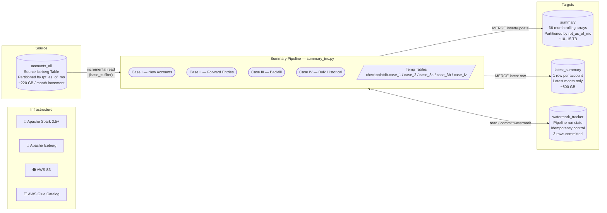
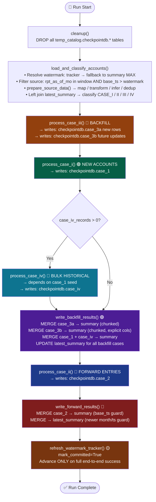
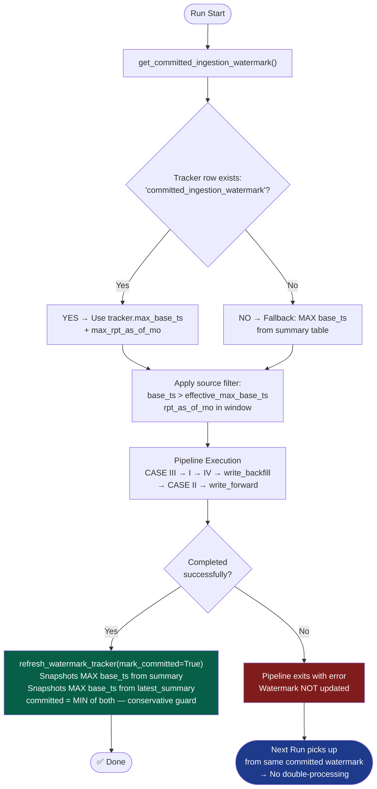
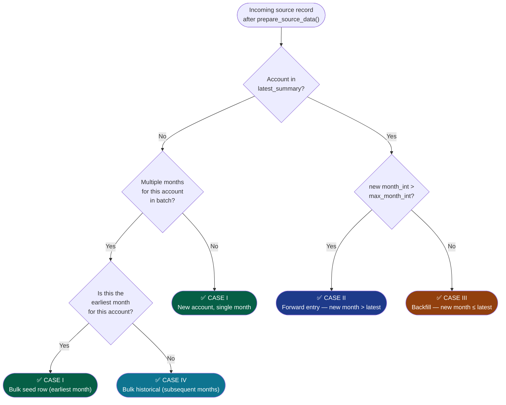

# Summary Pipeline (main) — Technical Design Document

**Document Version**: 1.0
**Pipeline Version**: main (post v9.4.8)
**Last Updated**: February 2026
**Author**: DataDominion Team

---

## Table of Contents

1. [Executive Summary](#1-executive-summary)
2. [System Overview](#2-system-overview)
3. [Architecture Design](#3-architecture-design)
4. [Watermark Tracker (New in main)](#4-watermark-tracker-new-in-main)
5. [Case Classification Logic](#5-case-classification-logic)
6. [Data Preparation](#6-data-preparation)
7. [Case I: New Accounts](#7-case-i-new-accounts)
8. [Case II: Forward Entries](#8-case-ii-forward-entries)
9. [Case III: Backfill](#9-case-iii-backfill)
10. [Case IV: Bulk Historical Load](#10-case-iv-bulk-historical-load)
11. [Write Phase](#11-write-phase)
12. [Performance Considerations](#12-performance-considerations)
13. [Configuration Reference](#13-configuration-reference)
14. [Assumptions and Constraints](#14-assumptions-and-constraints)

---

## 1. Executive Summary

### 1.1 Purpose

The Summary Pipeline maintains **36-month rolling history arrays** for consumer credit accounts. It incrementally processes incoming account data from a source Iceberg table and maintains a denormalized summary table with pre-computed arrays for efficient downstream credit bureau queries.

### 1.2 Scale

| Metric | Value |
|--------|-------|
| Summary Table Records | 500+ Billion |
| Unique Accounts | ~2 Billion |
| Rolling History Window | 36 months per account |
| Rolling Columns | 7 arrays per record |
| Monthly Throughput | ~50–100 Million records |

### 1.3 Why Case-wise Processing?

The pipeline separates records into four cases to minimise I/O at scale:

| Case | Frequency | I/O Pattern | Why Separate? |
|------|-----------|-------------|---------------|
| Case I | ~5% | Write only | No joins needed — brand new account |
| Case II | ~90% | Join latest row only | 50x less I/O than reading full summary |
| Case III | ~4% | Read full history | Expensive but unavoidable for backfill |
| Case IV | ~1% | Window on new data only | Bulk optimisation, no summary read |

A unified approach at 500B records would require loading existing summary data for **all** records, resulting in terabytes of unnecessary I/O.

---

## 2. System Overview

### 2.1 Technology Stack

| Component | Technology |
|-----------|------------|
| Processing Engine | Apache Spark 3.5+ |
| Table Format | Apache Iceberg |
| Storage | AWS S3 |
| Catalog | AWS Glue (`primary_catalog`) |
| Temp Storage | Hadoop Iceberg (`temp_catalog`) |
| Orchestration | AWS EMR / Airflow |

### 2.2 Tables



| Table | Purpose | Partitioning |
|-------|---------|----|
| `accounts_all` | Raw monthly account snapshots | `rpt_as_of_mo` |
| `summary` | Denormalised with rolling arrays | `rpt_as_of_mo` |
| `latest_summary` | Latest row per account (metadata) | None / bucketed |
| `watermark_tracker` | Pipeline run state and idempotency | None |

### 2.3 Rolling History Arrays

Each summary record contains arrays of length 36:

```
balance_am_history = [current, prev_1, prev_2, ..., prev_35]
                      ▲
                      │
                    Position 0 = Current month's value
                    Position 1 = Previous month's value
                    Position 35 = 35 months ago
```

**Rolling Columns (7 total):**

| Column | Type | Description |
|--------|------|-------------|
| `actual_payment_am_history` | Integer[36] | Monthly actual payment amounts |
| `balance_am_history` | Integer[36] | Monthly outstanding balances |
| `credit_limit_am_history` | Integer[36] | Monthly credit limits |
| `past_due_am_history` | Integer[36] | Monthly past-due amounts |
| `payment_rating_cd_history` | String[36] | Monthly payment rating codes |
| `days_past_due_history` | Integer[36] | Monthly days past due |
| `asset_class_cd_4in_history` | String[36] | Monthly asset classification |

**Grid Column (derived):**
- `payment_history_grid` — 36-character string concatenation of `payment_rating_cd_history`, using `?` as placeholder for NULL

---

## 3. Architecture Design

### 3.1 Design Principles

1. **Minimise I/O** — read only what is absolutely necessary per case
2. **Case Optimisation** — each case has its own processing path and merge strategy
3. **Partition Pruning** — all Iceberg reads use explicit partition filters
4. **Idempotent Runs** — watermark tracker ensures safe reruns without double-processing
5. **Temp Table Checkpointing** — per-case temp tables in `temp_catalog.checkpointdb` break Spark DAG lineage

### 3.2 Processing Flow



### 3.3 Per-Case Temp Tables

The main pipeline uses **dedicated temp tables per case** (rather than a single pooled temp table as in v9.4). This isolates each case's lineage and allows selective reading during the write phase.

| Temp Table | Written By | Read By |
|------------|------------|---------|
| `temp_catalog.checkpointdb.case_1` | `process_case_i` | `write_backfill_results` |
| `temp_catalog.checkpointdb.case_2` | `process_case_ii` | `write_forward_results` |
| `temp_catalog.checkpointdb.case_3a` | `process_case_iii` | `write_backfill_results` |
| `temp_catalog.checkpointdb.case_3b` | `process_case_iii` | `write_backfill_results` |
| `temp_catalog.checkpointdb.case_iv` | `process_case_iv` | `write_backfill_results` |

All temp tables are dropped by `cleanup()` at the start of each run, ensuring rerun safety.

---

## 4. Watermark Tracker (New in main)

### 4.1 Purpose

The watermark tracker is a dedicated Iceberg table that records the last successfully committed pipeline run. It enables **safe incremental reruns** — if a run fails midway, the next run picks up from the last committed point rather than re-processing already-written data.

### 4.2 Tracker Schema

```
watermark_tracker (
  source_name        STRING,     -- 'summary' | 'latest_summary' | 'committed_ingestion_watermark'
  source_table       STRING,     -- fully qualified table name
  max_base_ts        TIMESTAMP,  -- latest base_ts observed in source_table
  max_rpt_as_of_mo   STRING,     -- latest rpt_as_of_mo observed in source_table
  updated_at         TIMESTAMP   -- when this tracker row was refreshed (UTC)
)
```

### 4.3 How Watermark Works



### 4.4 Source Filtering Logic

```python
# Effective filter applied to accounts_all
(rpt_as_of_mo >= min_month_destination)      # only process months in summary window
AND (rpt_as_of_mo <  next_month)             # don't include future months
AND (base_ts      >  effective_max_base_ts)  # only pick up new/updated records
```

### 4.5 Pre-flight Validation

Before entering the pipeline, `load_and_classify_accounts` validates:
```python
assert max_month_destination == max_month_latest_history
# "summary and latest_summary must agree on max month"
```
This guards against a split-brain state where the two tables have diverged.

---

## 5. Case Classification Logic

### 5.1 Classification Algorithm



### 5.2 Classification Matrix

| Account Exists? | Months in Batch | Month vs Latest | Classification |
|-----------------|-----------------|-----------------|----------------|
| NO | 1 | N/A | CASE_I |
| NO | >1, earliest | N/A | CASE_I |
| NO | >1, not earliest | N/A | CASE_IV |
| YES | any | new > latest | CASE_II |
| YES | any | new <= latest | CASE_III |

### 5.3 MONTH_DIFF

Month integers are compared as `YEAR * 12 + MONTH`:

```
MONTH_DIFF = new_month_int - max_month_int

Examples:
  2026-01 vs 2025-12  → MONTH_DIFF =  1  (consecutive forward)
  2026-03 vs 2025-12  → MONTH_DIFF =  3  (gap of 2 months forward)
  2025-10 vs 2025-12  → MONTH_DIFF = -2  (backfill, 2 months back)
```

---

## 6. Data Preparation

```
prepare_source_data(df, config)
```

Executed for every incoming record before classification. Steps run in order:

| Step | Action | Config Key |
|------|--------|------------|
| 1 | Rename source → destination column names | `columns` |
| 2 | Apply sentinel value transformations (large negatives → NULL) | `column_transformations` |
| 3 | Evaluate inferred/derived columns (`orig_loan_am`, `payment_rating_cd`) | `inferred_columns` |
| 4 | Prepare rolling column values (apply mapper_expr) | `rolling_columns[].mapper_expr` |
| 5 | Validate date columns: year < 1000 → NULL | `date_col_list` |
| 6 | Deduplicate: per `(cons_acct_key, rpt_as_of_mo)`, keep highest `base_ts` (tie-break: `insert_ts`, `update_ts`) | — |

**Sentinel values replaced with NULL:** `-2147483647`, `-214748364`, `-21474836`, `-1` for monetary columns.

---

## 7. Case I: New Accounts

### 7.1 Definition

- Account does **NOT** exist in `latest_summary`
- Only **ONE** month of data in current batch (or it is the earliest month of a multi-month new account)

### 7.2 Processing Logic

```
Input:  Account 9001, Month 2026-01, balance = 5000

Output: balance_am_history = [5000, NULL, NULL, ..., NULL]
                              ▲     ▲
                              │     └── Positions 1-35: NULL (no prior data)
                              └── Position 0: Current month's value
```

### 7.3 Implementation

```python
# For each rolling column:
array([current_value]) + array_repeat(NULL, 35)  → [value, NULL×35]
```

### 7.4 Performance Characteristics

| Metric | Value |
|--------|-------|
| I/O Read | None |
| I/O Write | 1 row → case_1 temp table (+ merge to summary, latest_summary) |
| Shuffle | None |
| Complexity | O(1) per record |

---

## 8. Case II: Forward Entries

### 8.1 Definition

- Account **EXISTS** in `latest_summary`
- New month > current latest month (forward in time)

### 8.2 Processing Logic

```
Existing: Account 2001, Latest = 2025-12
          balance_am_history = [4500, 4000, 3500, ...]

New Data: Account 2001, Month = 2026-01, balance = 5000
MONTH_DIFF = 1 (consecutive)

Result:   balance_am_history = [5000, 4500, 4000, 3500, ...]
                                ▲     ▲
                                │     └── Previous array left-shifted by 1
                                └── New value at position 0
```

### 8.3 Gap Handling

When `MONTH_DIFF > 1`, NULLs are inserted for missing months:

```
Existing: Latest = 2025-12, balance_am_history = [4500, 4000, ...]
New Data: Month = 2026-03, balance = 5500 (MONTH_DIFF = 3)

Result:   balance_am_history = [5500, NULL, NULL, 4500, 4000, ...]
                                ▲     ▲     ▲
                                │     │     └── Feb 2026 (missing)
                                │     └── Jan 2026 (missing)
                                └── Mar 2026 value
```

### 8.4 Merge Guard

```sql
WHEN MATCHED AND c.base_ts >= s.base_ts THEN UPDATE SET *
```
Prevents older source records from overwriting newer summary rows.

### 8.5 Performance Characteristics

| Metric | Value |
|--------|-------|
| I/O Read | 1 row from `latest_summary` per account |
| I/O Write | 1 row → summary + 1 row update → latest_summary |
| Shuffle | Inner join on affected accounts only |
| Complexity | O(1) per record |

---

## 9. Case III: Backfill

### 9.1 Definition

- Account **EXISTS** in `latest_summary`
- New month ≤ current latest month (late-arriving historical data)

### 9.2 Two-Part Processing

Backfill results in two distinct writes:

```mermaid
%%{init: {"flowchart": {"useMaxWidth": true, "wrappingWidth": 600}} }%%
graph LR
    subgraph Input
        SRC[/"Backfill record<br/>account X, Oct 2025"/]
    end

    subgraph CASE_III_A["CASE III-A — Create backfill row"]
        A1["Find closest PRIOR summary row"]
        A2["Build array:<br/>[backfill_val | prior_history shifted by gap]"]
        A3["Fill chained gaps via peer_map<br/>(sibling backfills in same batch)"]
        A4[("Write to<br/>checkpointdb.case_3a")]
        A1 --> A2 --> A3 --> A4
    end

    subgraph CASE_III_B["CASE III-B — Patch ALL future rows"]
        B1["For each future month row<br/>(month > backfill month)"]
        B2["position = future_month_int − backfill_month_int<br/>history_array[position] = backfill_value"]
        B3["base_ts = GREATEST(existing_ts, new_base_ts)<br/>Only update: base_ts + *_history + grid cols"]
        B4[("Write to<br/>checkpointdb.case_3b")]
        B1 --> B2 --> B3 --> B4
    end

    subgraph Write["write_backfill_results()"]
        W1["MERGE case_3a → summary (chunked by month)"]
        W2["MERGE case_3b → summary (chunked, explicit cols only)"]
        W3["UPDATE latest_summary"]
        W1 --> W3
        W2 --> W3
    end

    SRC --> CASE_III_A
    SRC --> CASE_III_B
    A4 --> W1
    B4 --> W2

    style CASE_III_A fill:#1c1c1c,stroke:#d97706
    style CASE_III_B fill:#1c1c1c,stroke:#1f6feb
    style Write fill:#1c1c1c,stroke:#7c3aed
```



### 9.3 Partition-Pruned Summary Read

```
earliest_partition = min_backfill_month - 36 months
latest_partition   = max_backfill_month + 36 months

SELECT ... FROM summary
WHERE rpt_as_of_mo >= '{earliest_partition}'
  AND rpt_as_of_mo <= '{latest_partition}'
```

This prevents a full-table scan on the 500B+ row summary table.

### 9.4 Chained Backfill (Peer Map)

When multiple backfill months arrive for the same account in one batch:

```python
# Windowed Map: account → {month_int → struct(col_values)}
peer_map = map_from_entries(
    collect_list(struct(month_int, struct(*val_cols))).over(Window.partitionBy(pk))
)
```

During Case III-A row construction, gaps in the prior history are filled by looking up sibling backfill values from `peer_map` — avoiding expensive self-joins:

```
Batch arrives: April (4000), May (5000), June (6000) for Account X
Closest prior: January (1000)

Building June row (gap = 5 months from Jan):
  pos 1: peer_map[June - 1] = May   → 5000 ✓
  pos 2: peer_map[June - 2] = April → 4000 ✓
  pos 3: peer_map[June - 3] = March → NULL (not in batch) ✓
  pos 4: peer_map[June - 4] = Feb   → NULL (not in batch) ✓
  pos 5: prior_history[0]   = Jan   → 1000 ✓

Result: [6000, 5000, 4000, NULL, NULL, 1000, ...]
```

### 9.5 Chunked Merge

The write phase splits Case III into **balanced month-chunks** using a greedy bin-packing strategy:

```python
weighted_load = case3a_count + (case3b_weight × case3b_count)
chunks = build_balanced_month_chunks(month_weights, overflow_ratio=0.10)
```

Each chunk is merged independently, preventing large Iceberg commits that could cause memory pressure.

### 9.6 Performance Characteristics

| Metric | Value |
|--------|-------|
| I/O Read | Summary partitions within ±36 months of backfill range |
| I/O Write | New rows (3a) + N updates (3b) per backfill account |
| Shuffle | Join affected accounts + window for peer_map |
| Complexity | O(N × history_length) per account |

---

## 10. Case IV: Bulk Historical Load

### 10.1 Definition

- Account does **NOT** exist in `latest_summary`
- **Multiple** months of data arrive for this account in the current batch
- Handles first-time customers uploading 12, 36, or 72+ months at once

### 10.2 Processing Logic

Uses a `MAP_FROM_ENTRIES + TRANSFORM` strategy:

```
Account 8001 uploads 12 months (Jan–Dec 2025):

Jan 2025: [10000, NULL,  NULL,  ...]   ← from Case I seed
Feb 2025: [9500,  10000, NULL,  ...]   ← MAP[202502-1]=10000, MAP[202502-2]=NULL
Mar 2025: [9000,  9500,  10000, ...]   ← MAP lookup positions 0-35
...
Dec 2025: [4500,  5000,  ...,  10000, NULL...] ← full 36-month window
```

**Why MAP, not COLLECT_LIST:**
`COLLECT_LIST` skips gaps, causing array positions to be wrong. `MAP_FROM_ENTRIES` assigns values by `month_int` key, so missing months automatically return NULL.

### 10.3 Dependency on Case I

Case IV processes only the **subsequent** months of a new account. The earliest month is handled by Case I and must be written to `temp_catalog.checkpointdb.case_1` **before** Case IV runs.

```
Invariant: Case IV cannot exist without Case I in the same batch.
```

### 10.4 Performance Characteristics

| Metric | Value |
|--------|-------|
| I/O Read | None (all data is in the current batch) |
| I/O Write | One row per month → case_iv temp table |
| Shuffle | GROUP BY account to build MAPs + JOIN back |
| Complexity | O(records × columns × 36) |

---

## 11. Write Phase

### 11.1 write_backfill_results

Handles Case III (3a+3b), Case I, and Case IV:

```
1. Read case_3a (new backfill rows)
   → MERGE INTO summary  USING case_3a_chunk   [chunked by month]
     ON (pk, prt) — INSERT or UPDATE SET *

2. Read case_3b (future updates), filtered to exclude rows already in 3a
   → MERGE INTO summary  USING case_3b_chunk   [chunked by month]
     ON (pk, prt)
     WHEN MATCHED → UPDATE ONLY: base_ts (GREATEST), *_history, grid cols

3. Read case_1 + case_iv
   → MERGE INTO summary  USING union(case_1, case_iv)
     ON (pk, prt) — INSERT only for new rows

4. Update latest_summary for all 3 case types
```

### 11.2 write_forward_results

Handles Case II:

```
1. Read case_2 ; deduplicate by (pk, prt), keep highest base_ts

2. MERGE INTO summary USING case_2
   WHEN MATCHED AND c.base_ts >= s.base_ts THEN UPDATE SET *
   WHEN NOT MATCHED THEN INSERT *

3. Window to get latest per account from case_2

4. MERGE INTO latest_summary USING latest_case_2
   WHEN MATCHED AND (c.month > s.month OR (same month AND c.ts >= s.ts)) → UPDATE SET *
```

---

## 12. Performance Considerations

### 12.1 Write Partition Sizing

```python
get_write_partitions(spark, config, expected_rows, scale_factor, stage)
```

- Respects explicit `write_partitions` override in config
- Falls back to: `max(shuffle_partitions, expected_rows / rows_per_partition, parallelism_floor)`
- Cached once per run to avoid repeated driver calls

### 12.2 AQE Settings

```json
"spark.sql.adaptive.enabled": "true",
"spark.sql.adaptive.coalescePartitions.enabled": "true",
"spark.sql.adaptive.skewJoin.enabled": "true",
"spark.sql.adaptive.advisoryPartitionSizeInBytes": "128MB"
```

### 12.3 Cluster Configuration (Production)

| Setting | Value | Rationale |
|---------|-------|-----------|
| `dynamicAllocation.minExecutors` | 80 | Floor for large batches |
| `dynamicAllocation.maxExecutors` | 120 | Scale ceiling |
| `executor.cores` | 5 | Balance task concurrency |
| `executor.memory` | 30g | Leaves headroom for overhead |
| `autoBroadcastJoinThreshold` | -1 | All joins via sort-merge |
| `parquet.block.size` | 256 MB | Matches `maxPartitionBytes` |

### 12.4 S3 Tuning

```json
"spark.hadoop.fs.s3a.threads.max": "512",
"spark.hadoop.fs.s3a.max.total.tasks": "512",
"spark.hadoop.mapreduce.fileoutputcommitter.algorithm.version": "2"
```

---

## 13. Configuration Reference

Full config lives in `main/config.json`.

| Section | Key | Description |
|---------|-----|-------------|
| Tables | `source_table` | Input Iceberg table FQDN |
| Tables | `destination_table` | Summary Iceberg table FQDN |
| Tables | `latest_history_table` | Latest-row snapshot table FQDN |
| Schema | `primary_column` | Account PK (`cons_acct_key`) |
| Schema | `partition_column` | Monthly partition (`rpt_as_of_mo`) |
| Schema | `max_identifier_column` | Watermark timestamp (`base_ts`) |
| Schema | `history_length` | Rolling array length (36) |
| Mapping | `columns` | Source→destination column rename map (~35 entries) |
| Transform | `column_transformations` | Sentinel→NULL rules for monetary columns |
| Derived | `inferred_columns` | Calculated cols (`orig_loan_am`, `payment_rating_cd`) |
| Arrays | `rolling_columns` | 7 array-column definitions with mapper_expr + type |
| Arrays | `grid_columns` | Grid string columns derived from rolling columns |
| Filter | `coalesce_exclusion_cols` | Columns excluded from null-coalescing |
| Filter | `date_col_list` | Columns that get year-validity checks |
| Output | `latest_history_addon_cols` | Extra columns written to `latest_summary` |
| Spark | `spark.*` | Full Spark config block |

---

## 14. Assumptions and Constraints

| Invariant | Detail |
|-----------|--------|
| Case IV requires Case I | Every `CASE_IV` record in a batch must have a corresponding `CASE_I` record for the same account |
| Processing order is critical | `CASE_III → CASE_I → CASE_IV → write_backfill → CASE_II → write_forward` — violating this corrupts arrays |
| Watermark atomicity | `committed_ingestion_watermark` advances **only** after a clean end-to-end run |
| Case III-B timestamp | `GREATEST(existing_ts, new_base_ts)` — timestamps never regress |
| Case III-B explicit merge | Only `base_ts`, rolling `*_history`, and `grid_columns` are updated — non-rolling columns are left unchanged |
| summary ↔ latest_summary sync | `max_month_destination == max_month_latest_history` is enforced at startup |
| Temp table lifecycle | `cleanup()` drops all `checkpointdb.*` tables before each run to ensure idempotency |
| Source window | Only months `>= min_month_destination` and `< next_month` are read — prevents re-processing old closed partitions |
