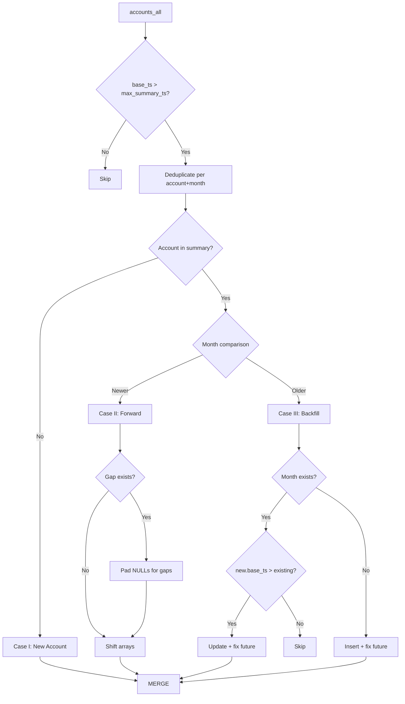

# Incremental Summary Update Script (v3)

Scale: **500B+ summary records**, **1B monthly updates**

## Tables

| Table | Description |
|-------|-------------|
| **`default.default.accounts_all`** | Source raw account records |
| **`default.summary_testing`** | Target summary with 36-month history arrays |

---

## Scenarios

### Case I - New `cons_acct_key`
- Create new summary row with NULL history padding
- MERGE to summary

### Case II - Forward Month Entry
- If there are **month gaps** between last entry and new month, pad with NULLs
- Shift history arrays, insert new values at index 0
- MERGE to summary

### Case III - Backfill

#### III.1 - Month Already Exists
- **Only update if `new.base_ts > existing.base_ts`**, else ignore
- If updated, fix all future rows' history arrays

#### III.2 - Single-Gap Fill
- Insert row for missing month
- Update all future rows' history arrays

#### III.3 - Multi-Gap Fill  
- Insert row for missing month
- Update all future rows' history arrays

> [!IMPORTANT]
> Use **MERGE for ALL scenarios** - no APPEND.

---

## Data Flow

---

## Scalability

1. **Partition pruning**: Filter by `rpt_as_of_mo`
2. **Broadcast joins**: For filtered account lists
3. **Native Spark array ops**: No `applyInPandas`
4. **Iceberg MERGE**: Atomic upserts

---

## Verification

1. Test all 3 cases + sub-scenarios
2. Verify future rows updated correctly on backfill
3. Performance target: <10 min for 1B updates
